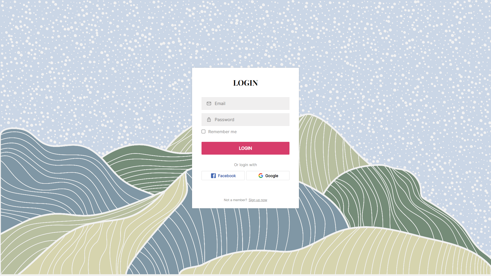
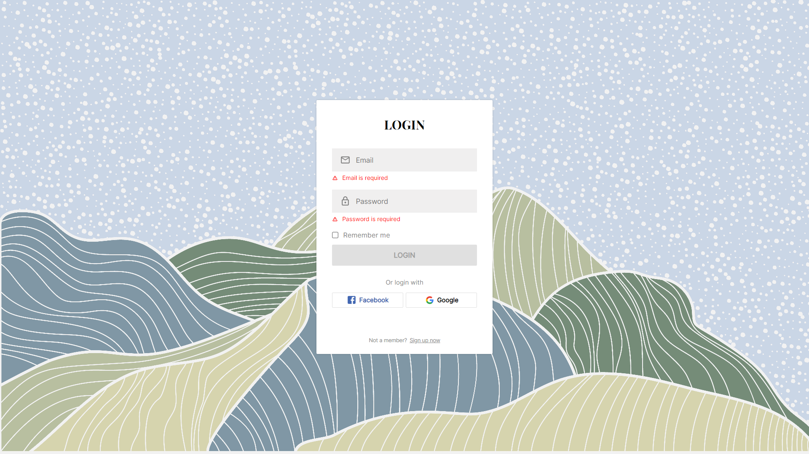
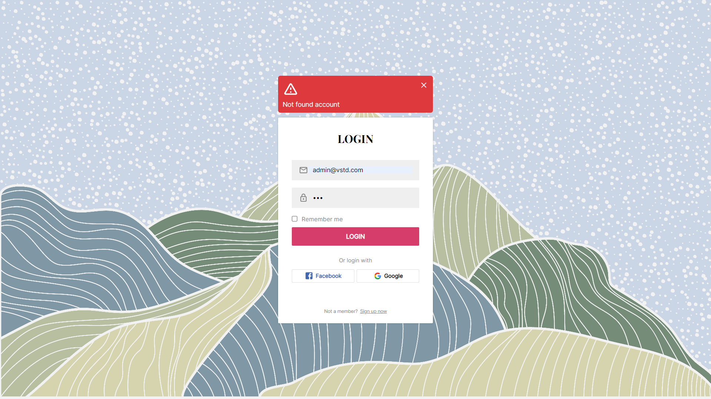
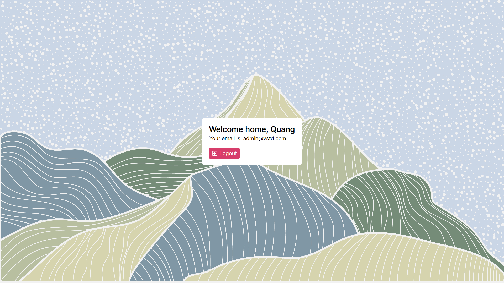

# UI Login Page

Assigned exercise using ReactJS to copycat a login page UI, no processing logic required.

## Screenshots:

_Target_


_Result_


_Login Failed_


_Account Not Found_


_Home Screen_

## Installation

### Prerequisites

Before you continue, ensure you meet the following requirements:

    * Stable internet connection
    * You have installed the latest version of NodeJS.

1. Clone project:
```
git clone https://gitlab.com/inusedname/login-page-reactjs.git
```
2. Install required dependencies:
```
npm install
```
3. Run app:
```
npm start
```

## References:
https://www.youtube.com/watch?v=91qEdc6dSUs